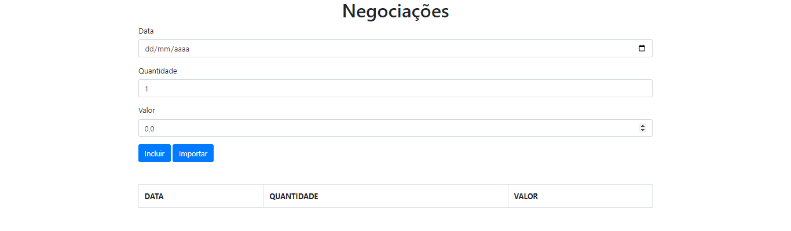
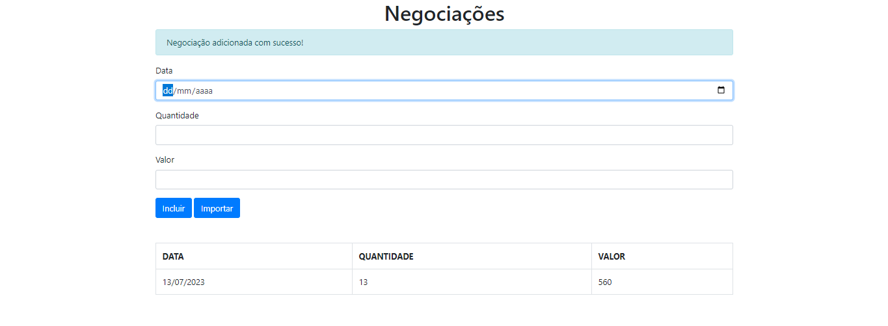
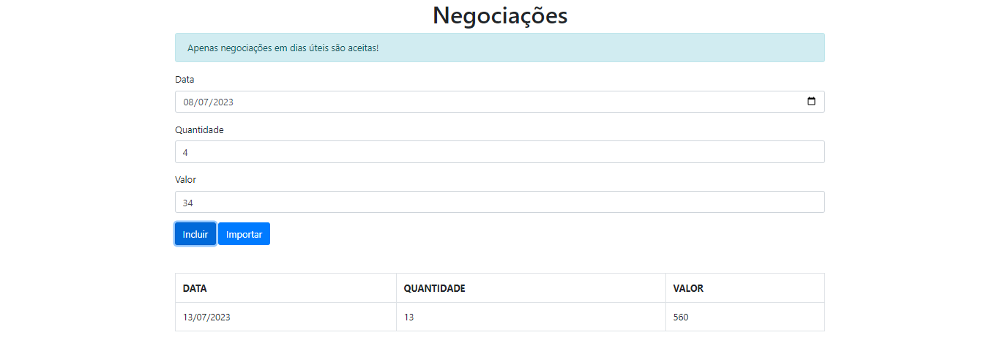
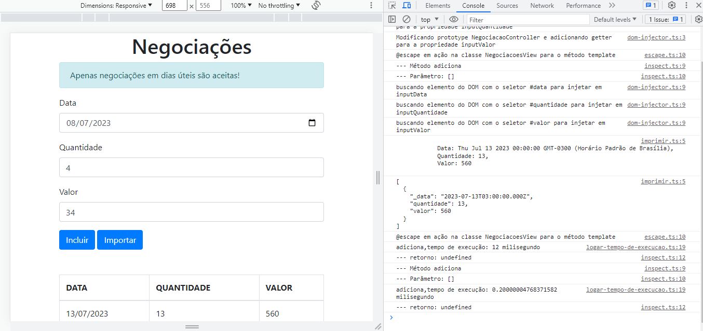

# Aplicação TypeScript

Projeto do curso de TypeScript da Alura, onde a proposta é criar uma aplicação de negociação de bolsa de valores, utilizando o principalmente o TypeScript.

## Tecnologias utilizadas no projeto
* TypeScript
* JavaScript
* Bootstrap

<h3>Contribuindo</h3>

⭐️ Star o projeto

🐛 Encontrar e relatar issues